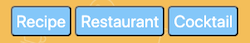

## Mood Food App!

# We use YOUR mood to help select YOUR food. 

# Overview
- Mood Food is an application that helps the user decide a food option based off their mood. Users can select whether they would like a recipe, restaurant or cocktail (only if over 21).

# Utilizing our App
1. Access the [Mood Food App](https://hgowton.github.io/MoodFood/). 
1. Complete the quick poll with:
   * an image url showing your current mood (copy/paste)
   * your age
   * zip code
   

1. Click *What's my Mood?* and the Face API will decipher your current mood.
1. Select what you are in the mood for 
1. You will be provided with 3 options based on your mood, location, and selection.
   * *Restaurant or Cocktail*: 
      * name
      * rating 
      * address
      * phone number
      * link to the restaurant's website on Yelp
   
   

   * *Recipe*:
      * name
      * servings
      * health labels
      * ingredients
      * link to the original recipe's website
   
   

## Tech Used
- HTML
- CSS
- Javascript
- JQuery
- Materialize
- Font Awesome
- AJAX Requests
- Face ++ API
- Edamam API
- Yelp API

## Contributors
* Heather Gowton
* Cassandra Heil
* Helen Maschmeyer
* Beverly Thomas
